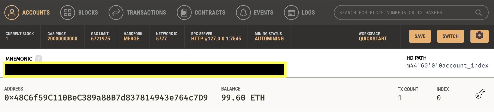
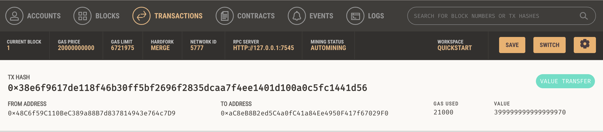
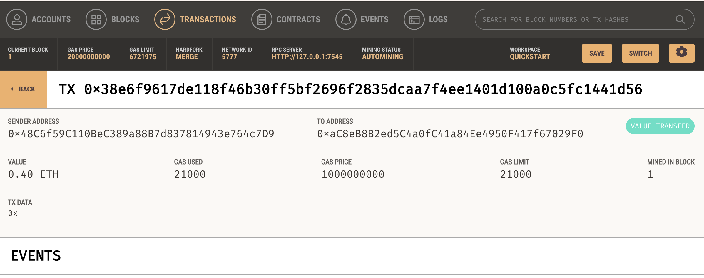
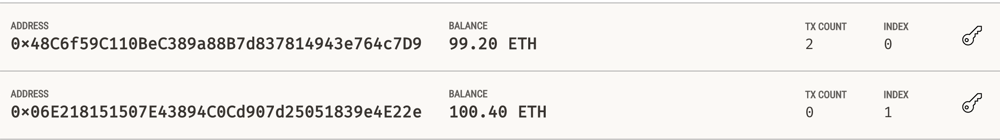
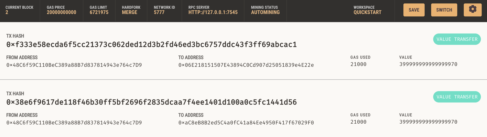
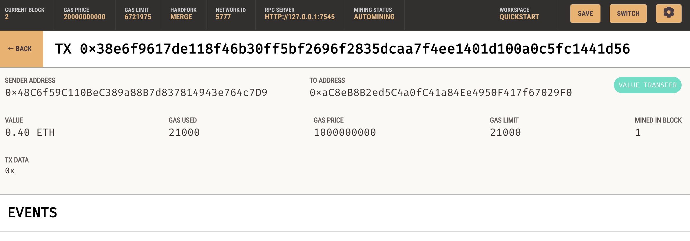

# KryptoJobs2Go
The objective of this excercise is to create an application that enables sending cryptocurrency payments to a list of professional candidates. 

To be able to use the code please write your ganache's MNEMONIC seed phrase in the SAMPLE.env file.

The "krypto_jobs.py" contains the code associated with the web interface of the application (compatible with Streamlit library) and the "crypto_wallet.py" contains the Ethereum transaction functions. 

The krypto_jobs.py follows this steps:
1) Generates a new Ethereum account instance by using the mnemonic seed phrase found in SAMPLE.env file.
2) Fetchs and displays the account balance associated with the Ethereum account address.
3) Calculates the total value of an Ethereum transaction, including the gas estimate, that pays a KryptoJobs2Go candidate for their work.
4) Digitally signs a transaction that pays a KryptoJobs2Go candidate, and send this transaction to the Ganache blockchain.

The libraries and dependencies used are:
- streamlit
- dataclasses
- typing 
- web3
- os
- requests
- dotenv 

## Results
I first tried the transactions using the addresses provided in this excercise: 
Address balance 
 
Transaction page  
 
Transaction details  
 

Secondly, I changed the potential candidate addresses to the ones I had in my ganache page. With this I was able to see the recepient's balance: 
Address balance 
 
Transaction page  
 
Transaction details  
 
